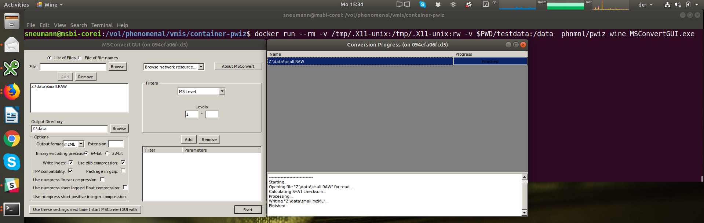

# Proteowizard msconvert
Version: 3.0.18114

## Short Description

Conversion of mass spectrometry vendor formats to mzML.

## Description

The first step in a metabolomics data processing workflow with Open
Source tools is the conversion to an open raw data format like
[mzML](https://github.com/HUPO-PSI/mzML/). One of the main routes to mzML-formatted data is using Open Source converter
msconvert developed by the Proteowizard team (Chambers et al. 2012),
which is one of the reference implementations for mzML. It can convert
to mzML from Sciex, Bruker, Thermo, Agilent, Shimadzu, Waters
and also the earlier file formats like mzData or mzXML.
Although Proteowizard was initially targeting LC/MS data, it can also readily
convert GC/MS data for example from the Waters GCT Premier or Agilent instruments.

## Key features
- MS raw data conversion

## Functionality
- Preprocessing

## Approaches
- Metabolomics
- Lipidomics
- Glycomics
- Proteomics

## Instrument Data Types
- MS

## Screenshots

## Tool Authors
- Several hundred labs around the world are using ProteoWizard within their development processes and computational workflows. We'd like to thank the many users who have contributed feedback to the project. We also thank the TPP team for their ongoing support.
- See http://proteowizard.sourceforge.net/team.html for the full list of contributors.

## Container Contributors
- [Steffen Neumann](https://github.com/sneumann) (IPB Halle)
- [Rene Meier](https://github.com/meier-rene) (IPB Halle)
- [Pablo Moreno](https://github.com/pcm32) (EMBL-EBI)
- [Pierrick Roger](https://github.com/pkrog) (CAE)

## Website
- http://proteowizard.sourceforge.net/

## Git Repository
- https://github.com/phnmnl/container-pwiz.git

## Installation

The conversion can be started with e.g.

`docker run -v $PWD:/data:rw phnmnl/phnmnl/pwiz--i-agree-to-the-vendor-licenses:latest /data/neg-MM8_1-A,1_01_376.d -o /data/ --mzML`

The currently tested vendor formats are:

* mzXML: `docker run -it -v $PWD:/data phnmnl/pwiz--i-agree-to-the-vendor-licenses:latest threonine_i2_e35_pH_tree.mzXML`
* Bruker .d: `docker run -it -v $PWD:/data phnmnl/phnmnl/pwiz--i-agree-to-the-vendor-licenses:latest neg-MM8_1-A,1_01_376.d`

To run the MSconvertGUI as shown in the above screenshot, you have to enable X11 access on the client machine, and pass the X11 information to the container:

`docker run --rm -v /tmp/.X11-unix:/tmp/.X11-unix:rw -v $HOME:/data:rw phnmnl/pwiz--i-agree-to-the-vendor-licenses wine MSconvertGUI`

## Galaxy usage

A rudimentary Galaxy node description is included as `msconvert.xml`,
it was obtained from the `msconvert.ctd` using
`python CTD2Galaxy/generator.py -i /vol/phenomenal/vmis/docker-pwiz/msconvert.ctd -m sample_files/macros.xml -o /vol/phenomenal/vmis/docker-pwiz/msconvert.xml`

## Build instructions

Please note that for licensing reasons we can not include all required
files in this repository. Upon container building, the Proteowizard files
will be downloaded from http://proteowizard.sourceforge.net/downloads.shtml and included
in the created container. By building this container, you agree
to all the vendor licenses that are shown at the above download links,
and also included in the container and Dockerfile repository. To build, please use

`docker build --tag="phnmnl/pwiz--i-agree-to-the-vendor-licenses:latest" .`

Also note that the build is known to fail with Docker-1.9, make sure to use Docker-1.10 or above.

## Publications

Chambers MC, Maclean B, Burke R, Amodei D, Ruderman DL, Neumann S, Gatto L,
Fischer B, Pratt B, Egertson J, Hoff K, Kessner D, Tasman N, Shulman N, Frewen B,
Baker TA, Brusniak MY, Paulse C, Creasy D, Flashner L, Kani K, Moulding C,
Seymour SL, Nuwaysir LM, Lefebvre B, Kuhlmann F, Roark J, Rainer P, Detlev S,
Hemenway T, Huhmer A, Langridge J, Connolly B, Chadick T, Holly K, Eckels J,
Deutsch EW, Moritz RL, Katz JE, Agus DB, MacCoss M, Tabb DL, Mallick P. A
cross-platform toolkit for mass spectrometry and proteomics. Nat Biotechnol. 2012
Oct;30(10):918-20. doi: 10.1038/nbt.2377. PubMed PMID: 23051804; PubMed Central
PMCID: PMC3471674.

## Licensing: APACHE LICENSE
Please see LICENSES/LICENSE, this Apache License Covers Core ProteoWizard Tools and Library. This software does, however, depend on other software libraries which place further restrictions on its use and redistribution, see below.

### ADDENDUM TO APACHE LICENSE

To the best of our ability we deliver this software to you under the Apache 2.0 License listed below (the source code is available in the ProteoWizard project). This software does, however, depend on other software libraries which place further restrictions on its use and redistribution. By accepting the license terms for this software, you agree to comply with the restrictions imposed on you by the
[license agreements of the software libraries](LICENSES/VENDORLICENSES.html)
 on which it depends:

* AB Sciex WIFF Reader Library
* Agilent Mass Hunter Data Access Component Library
* Bruker CompassXtract
* Shimadzu SFCS
* Thermo-Scientific MSFileReader Library
* Waters Raw Data Access Component Library

NOTE: If you do not plan to redistribute this software yourself, then you are the "end-user" in the above agreements.
